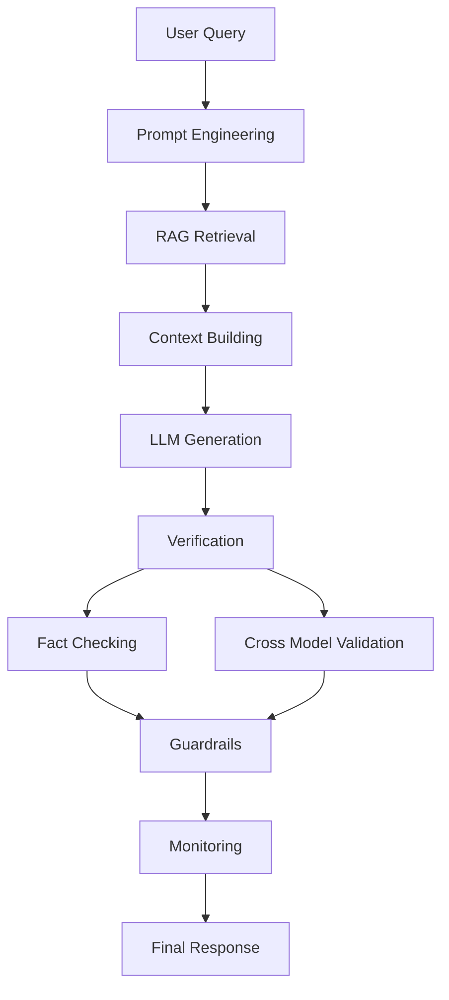

# Awesome LLM Hallucination Mitigation

 

A curated collection of **techniques, tools, research papers, and
practical engineering strategies to detect, evaluate, and reduce
hallucinations in Large Language Models (LLMs).**

------------------------------------------------------------------------

## What is LLM Hallucination

LLM hallucination occurs when a language model generates **plausible but
incorrect or fabricated information**.\
Instead of retrieving verified knowledge, the model predicts text
statistically and may produce:

-   fabricated facts
-   invented citations
-   incorrect reasoning
-   fake APIs or libraries
-   unsupported claims

Example:

Prompt

    Who invented the Python programming language in 1995?

Hallucinated answer

    Python was invented by John McCarthy in 1995.

Correct answer

    Python was created by Guido van Rossum and released in 1991.

## Hallucination Mitigation Architecture

---

# Why Hallucination Happens

LLMs hallucinate due to fundamental limitations in how they are trained.

### 1. Next-token prediction objective
Models generate text based on probability rather than truth verification.

### 2. Incomplete training data
The model may not have seen certain facts or may have conflicting information.

### 3. Lack of grounding
The model often generates answers without referencing external knowledge sources.

### 4. Overgeneralization
The model fills missing knowledge gaps with plausible guesses.

### 5. Retrieval failures
In RAG systems, poor retrieval can cause grounded hallucinations.

---

# Repository Structure

This repository is organized to mirror the **actual lifecycle of reliable LLM systems**.

Foundations
↓
Detection
↓
Mitigation
↓
Authentication
↓
Evaluation
↓
Industrial Deployment

# Directory overview:

01_foundations
02_detection_methods
03_mitigation_strategies
04_authentication_layer
05_evaluation_frameworks
06_industrial_architecture
07_industry_use_cases
08_open_source_tools
09_research_papers
10_datasets
11_open_problems

---

# Hallucination Taxonomy

Hallucinations can be categorized into several types:

### Factual hallucination
Incorrect statements about real-world facts.

### Fabricated references
Invented citations, sources, or research papers.

### Reasoning hallucination
Logical reasoning errors that lead to false conclusions.

### Instruction hallucination
Generating outputs that violate prompt instructions.

### Grounding hallucination
Outputs that contradict provided context or retrieved documents.

---

# Detection Methods

Detecting hallucinations is an active research area.

Common approaches include:

### Uncertainty-based detection
- entropy analysis
- token probability thresholds
- confidence scoring

### Self-evaluation
- LLM critique
- self-consistency checking
- reflection prompts

### Embedding similarity
- compare answer embeddings with source documents
- detect unsupported claims

### Contradiction detection
- natural language inference models
- fact consistency scoring

### External verification
- retrieval-based fact checking
- knowledge base verification

---

# Mitigation Strategies

Hallucination mitigation techniques operate at **three stages**.

---

## Pre-Generation

Techniques applied before the model generates text.

Examples:

- Retrieval-Augmented Generation (RAG)
- Knowledge graph grounding
- Prompt engineering
- Query rewriting
- Controlled context injection

---

## During Generation

Techniques applied while the model is generating responses.

Examples:

- Constrained decoding
- Chain-of-verification
- reasoning scaffolding
- self-reflection prompts
- step-by-step reasoning control

---

## Post Generation

Techniques applied after an answer is generated.

Examples:

- claim extraction
- fact verification
- answer revision
- contradiction detection
- abstention mechanisms

---

# Authentication Layer

Reliable AI systems require **verification and provenance tracking**.

Key concepts include:

### Evidence alignment
Ensure every claim is supported by retrieved evidence.

### Citation verification
Validate that referenced sources exist and are correct.

### Provenance tracking
Track which documents contributed to each answer.

### Trusted knowledge sources
Use verified knowledge bases and curated datasets.

### Source attribution
Ensure responses reference verifiable sources.

---

# Evaluation Frameworks

Reliable LLM systems require **objective evaluation metrics**.

Common evaluation methods include:

### Factuality metrics
Measure correctness of generated statements.

### Groundedness metrics
Evaluate alignment with provided context.

### Hallucination rate
Percentage of unsupported claims.

### RAG evaluation
Measure retrieval relevance and answer grounding.

### Human evaluation
Expert review of factual correctness.

---

# Industrial LLM Architecture

Production-grade LLM systems require **multiple verification layers**.

Example architecture:
User Query
↓
Query Rewriter
↓
Retriever
↓
Context Filter
↓
LLM Generation
↓
Claim Extractor
↓
Fact Verification Model
↓
Confidence Scoring
↓
Final Answer

Additional production components:

- LLM guardrails
- observability systems
- hallucination monitoring
- feedback loops

---

# Industry Use Cases

Hallucination mitigation is critical in:

### Healthcare
Clinical decision support systems.

### Finance
Risk analysis, research assistants, trading systems.

### Legal
Case law research and legal drafting.

### Enterprise Search
Corporate knowledge retrieval.

### Customer Support
Automated help systems.

---

# Open Source Tools

Popular tools for hallucination detection and evaluation:

- Guardrails AI
- TruLens
- RAGAS
- Cleanlab
- DeepEval
- LangSmith
- LlamaIndex evaluation

---

# Research Papers

Important research areas include:

- hallucination detection
- factuality evaluation
- RAG grounding
- verification models
- uncertainty estimation

See the `09_research_papers` directory.

---

# Datasets

Common datasets for hallucination research:

- TruthfulQA
- HaluEval
- FEVER
- Natural Questions
- RAGBench

---

# Open Problems

Major open challenges include:

### Reliable hallucination detection
No detector is consistently reliable across tasks.

### Grounding at scale
Large knowledge bases introduce retrieval complexity.

### Multi-hop verification
Complex answers require reasoning across multiple sources.

### Domain-specific factuality
Healthcare and finance require stricter verification.

### Evaluation benchmarks
Hallucination measurement remains inconsistent.

---

# Contributing

Contributions are welcome.

You can contribute by adding:

- research papers
- open source tools
- evaluation frameworks
- industrial architectures
- real-world failure cases

Please follow the guidelines in `CONTRIBUTING.md`.

---

# License

MIT License

---

# Acknowledgements

Inspired by research from the LLM, NLP, and AI infrastructure communities working on improving **reliability, safety, and trustworthiness of language models**.

---

# Star the Repo

If this repository helps your work, please consider starring it.
