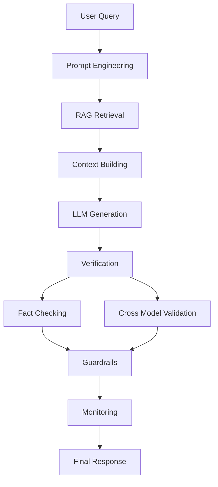

[awesome-llm-hallucination-mitigation_README.md](https://github.com/user-attachments/files/25840557/awesome-llm-hallucination-mitigation_README.md)
# Awesome LLM Hallucination Mitigation

 

A curated collection of **techniques, tools, research papers, and
practical engineering strategies to detect, evaluate, and reduce
hallucinations in Large Language Models (LLMs).**

------------------------------------------------------------------------

## What is LLM Hallucination

LLM hallucination occurs when a language model generates **plausible but
incorrect or fabricated information**.\
Instead of retrieving verified knowledge, the model predicts text
statistically and may produce:

-   fabricated facts
-   invented citations
-   incorrect reasoning
-   fake APIs or libraries
-   unsupported claims

Example:

Prompt

    Who invented the Python programming language in 1995?

Hallucinated answer

    Python was invented by John McCarthy in 1995.

Correct answer

    Python was created by Guido van Rossum and released in 1991.

------------------------------------------------------------------------

## Why Hallucination Matters

Hallucinations create real risks in production AI systems.

  Domain             Risk
  ------------------ ------------------------------
  Healthcare         Incorrect medical advice
  Finance            Wrong financial calculations
  Legal              Fabricated case law
  Customer support   False product information
  Research           Fake academic citations

Real incidents include lawyers submitting **AI-generated fake legal
cases** and chatbots providing **incorrect company policies**.

------------------------------------------------------------------------

## Hallucination Mitigation Architecture

## Practical Examples of Hallucinations

### 1. Factual Hallucination

Prompt

    Where is the Eiffel Tower located?

Hallucinated output

    The Eiffel Tower is located in Berlin, Germany.

Correct answer

    The Eiffel Tower is located in Paris, France.

------------------------------------------------------------------------

### 2. Citation Hallucination

Prompt

    Give research papers about hallucinations in LLMs.

Hallucinated output

    Smith et al., 2021. Understanding GPT hallucinations.
    Journal of Artificial Intelligence Systems.

Problem: the paper **does not exist**.

Real papers

-   TruthfulQA (2021)
-   Chain‑of‑Verification (2023)

------------------------------------------------------------------------

### 3. Reasoning Hallucination

Prompt

    If a car travels 60 km/h for 3 hours, how far does it go?

Hallucinated reasoning

    distance = speed + time
    distance = 60 + 3 = 63 km

Correct reasoning

    distance = speed × time
    distance = 60 × 3 = 180 km

------------------------------------------------------------------------

### 4. Numeric Hallucination

Prompt

    What is 15% of 260?

Hallucinated output

    15% of 260 is 29

Correct answer

    39

------------------------------------------------------------------------

### 5. Context Hallucination (Common in RAG)

Prompt with context

    Context:
    Python was created by Guido van Rossum.

    Question:
    Who created Python?

Correct output

    Guido van Rossum

Hallucinated output

    Python was created by Guido van Rossum and later expanded by Google engineers.

The second statement **was never in the provided context**.

------------------------------------------------------------------------

## Hallucination Frequency in Practice

Research and industry benchmarks show hallucinations occur frequently
when models lack grounding.

  -----------------------------------------------------------------------
  Study                        Finding
  ---------------------------- ------------------------------------------
  TruthfulQA                   GPT‑3 truthfulness around \~58%

  OpenAI GPT‑4 report          GPT‑4 reduces but does not eliminate
                               hallucinations

  RAG evaluations              30--50% of RAG errors come from context
                               misuse

  Code generation studies      LLMs frequently invent APIs
  -----------------------------------------------------------------------

------------------------------------------------------------------------

## Common Hallucination Types in Production

  Rank   Hallucination Type       Cause
  ------ ------------------------ -------------------------------
  1      Factual hallucination    Missing knowledge
  2      Context hallucination    Ignoring retrieved documents
  3      Code hallucination       Predicting APIs statistically
  4      Citation hallucination   Predicting citation patterns
  5      Numeric hallucination    Arithmetic limitations

------------------------------------------------------------------------

## Techniques to Reduce Hallucinations

  Category             Technique
  -------------------- --------------------------------
  Prompt engineering   Chain‑of‑Thought prompting
  Prompt engineering   Few‑shot prompting
  Retrieval            Retrieval‑Augmented Generation
  Verification         LLM‑as‑judge
  Verification         Fact checking
  Guardrails           Output validation
  Tool use             Calculator / code interpreter
  Monitoring           LLM observability systems

------------------------------------------------------------------------

## Open Source Tools

  ---------------------------------------------------------------------------------------------
  Tool                    Category                Link
  ----------------------- ----------------------- ---------------------------------------------
  RAGAS                   RAG evaluation          https://github.com/explodinggradients/ragas

  DeepEval                LLM evaluation          https://github.com/confident-ai/deepeval

  Promptfoo               Prompt testing          https://github.com/promptfoo/promptfoo

  TruLens                 LLM observability       https://github.com/truera/trulens

  Guardrails AI           Output validation       https://github.com/guardrails-ai/guardrails

  LangSmith               LLM monitoring          https://smith.langchain.com

  ---------------------------------------------------------------------------------------------

------------------------------------------------------------------------

## Research Papers

  -----------------------------------------------------------------------
  Paper                               Link
  ----------------------------------- -----------------------------------
  Retrieval‑Augmented Generation      https://arxiv.org/abs/2005.11401

  Chain‑of‑Thought Prompting          https://arxiv.org/abs/2201.11903

  Self Consistency Improves Reasoning https://arxiv.org/abs/2203.11171

  TruthfulQA Benchmark                https://arxiv.org/abs/2109.07958

  -----------------------------------------------------------------------

------------------------------------------------------------------------

## Contributing

Contributions are welcome.

You can contribute:

-   hallucination mitigation techniques
-   research papers
-   tools
-   datasets
-   case studies

Submit a pull request.

------------------------------------------------------------------------

## License

MIT License
